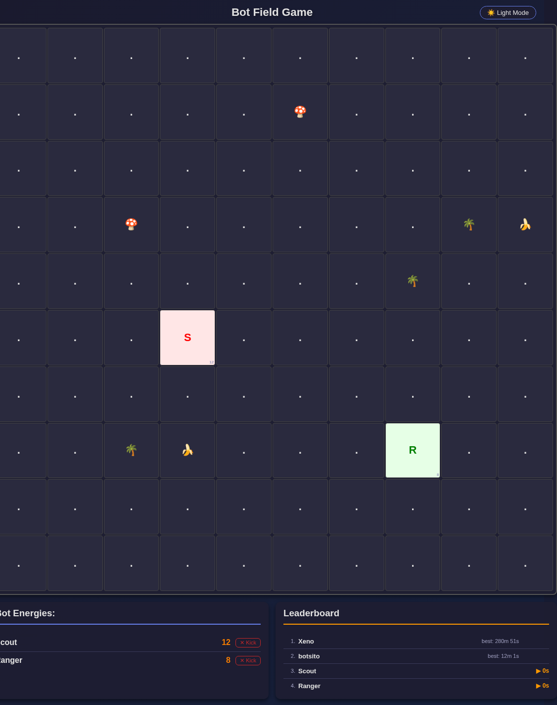
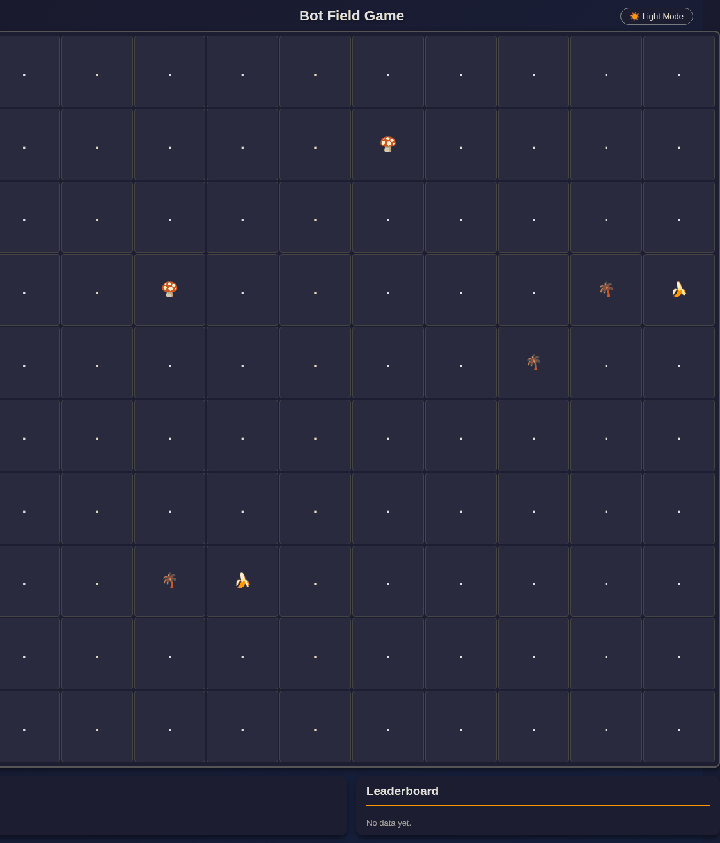

# Bot Field Game

A real-time 10×10 arena where autonomous bots hunt bananas, dodge poison, and climb a survival leaderboard.






## Why

Most bot sandboxes are logs and unit tests. This one is a live field you can watch: bots report a position and energy, the server reveals a 5×5 neighborhood, and a browser paints the grid as they eat, collide with rules, and die.

It is a compact playground for writing movement strategies — pathing, memory, risk — without a game engine.

## Features

- **FastAPI + WebSocket server** with a Jinja2 live board (`/` and `/ws/web`)
- **JSON bot protocol** on `WS /ws` (and the same payload via `POST /ws`)
- **5×5 vision** (radius 2, 24 cells): empty tiles, food, poison, trees, other bots, or void
- **Data-driven items** in `items.json`: bananas (+5 energy, spawn next to trees), poison mushrooms (−3), non-walkable banana trees
- **Survival scoring**: session timer, persisted best times in `leaderboard.json`, all-time record in `records.json`
- **Spectator UI**: dark/light theme, per-bot energy, kick button (`POST /kick`)
- **Idle reset**: the field clears after a few seconds without bot traffic (trees stay)
- **Sample client** (`bot.py`): remembers food, walks toward it, optionally guards a banana, otherwise explores

## How it works

```
  bot.py / any client              FastAPI (main.py)                 Browser
  --------------------             -----------------                 -------
  {x, y, nickname, energy}  --->   validate + place bot
                                   consume item on tile
                                   build 24-cell FOV          --->   /ws/web
  {positions: [...]}        <---   broadcast grid + times            paint 10×10
                                   persist records on death
```

Coordinate system: `x` grows right, `y` grows up, both in `0..9`. The HTML board flips `y` so row 0 is the top of the screen.

Item rules live in `items.json` (walkable, consumable, energy, respawn interval, max on map). Trees are placed once at startup; bananas only appear on orthogonally adjacent empty cells.

## Quickstart

Requires Python 3.10+.

```bash
python3 -m venv .venv
source .venv/bin/activate   # Windows: .venv\Scripts\activate
pip install -r requirements.txt
python main.py
```

Open [http://localhost:8001](http://localhost:8001) — `main.py` binds **port 8001**.

In another terminal:

```bash
source .venv/bin/activate
python bot.py
```

The sample bot defaults to `ws://localhost:8000/ws`. Point it at this server:

```bash
WEBSOCKET_URL=ws://localhost:8001/ws python bot.py
```

Manual turn (HTTP):

```bash
curl -s -X POST http://localhost:8001/ws \
  -H 'Content-Type: application/json' \
  -d '{"x": 5, "y": 5, "nickname": "Scout", "energy": 10}'
```

Expected shape of a successful reply:

```json
{
  "positions": [
    {"x": 4, "y": 5, "content": null},
    {"x": 6, "y": 5, "content": {"type": "food", "value": 5, "walkable": true}}
  ]
}
```

Energy `<= 0` returns `{"positions": []}` and removes the bot. Invalid payloads return `{"error": "..."}`.

## Project structure

```
.
├── main.py            # FastAPI app, WS protocol, regen loops, scoring
├── bot.py             # Example autonomous client
├── items.json         # Item definitions (food, poison, trees, void, bot)
├── templates/
│   └── index.html     # Live board, energies, leaderboard
├── records.json       # Best survival record
├── leaderboard.json   # Per-nickname best seconds
├── requirements.txt
└── assets/
    ├── screenshot.png
    └── demo.gif
```

## Limitations

- Live positions are **in-memory**; only records and the leaderboard survive a restart.
- `/kick` and `/ws` have **no authentication**.
- The arena size (10×10) and the sample bot nickname (`orion`) are hardcoded.
- The sample bot talks to port **8000** unless `WEBSOCKET_URL` is set; the server listens on **8001**.
- Bots report their own energy; the server does not apply food/poison deltas for them.

## License

MIT. See [LICENSE](LICENSE).
